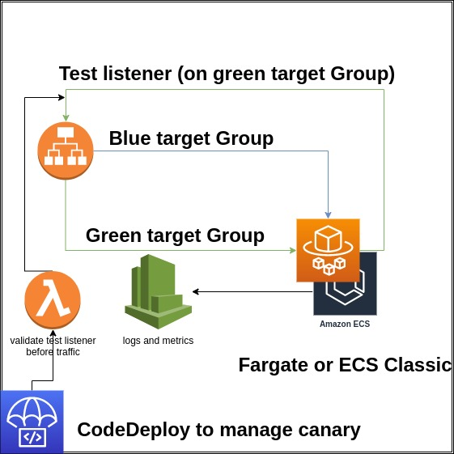

# Terraform ECS Application

This module generate all core resources of ECS Application. you can use with Application load balancer and deploy securely with [CodeDeploy](https://aws.amazon.com/pt/codedeploy/).

## Inspiration

We used these public modules to generate this module in a single one resource module:

* [ECS service from Trussworks](https://registry.terraform.io/modules/trussworks/ecs-service/aws/latest)
* [Official alb module from AWS](https://registry.terraform.io/modules/terraform-aws-modules/alb/aws/latest)
* [CodeDeploy ECS from Faros-AI](https://registry.terraform.io/modules/faros-ai/codedeploy-for-ecs/aws/latest)

This modules are **excelents**, but we need to customize some itens.

* Guarantee all resources to receive our tags (we use Billing Tags)
* Simplify complexibility from module consumers the responsibility to create target groups for CodeDeploy
* Integrate CodeDeploy with uniformity in all applications (we plan to use this module in varios applications)
* Remove responsability of customize Autoscaling policy from ECS Application module (We need to use some custom rules for scaling policies)
* Change loop interaction from `count` to `for_each` (for_each is better)
* Convert some variables from list(some_type) to set(some_type) (sets are immutable when change order of the elements)
* Converge all decision in a single `locals` block (better to manage changes and code review)

## Features inner this module

* Create BLUE/GREEN target groups to connect in multiples Listeners in a Application Load Balancers (ALB).
* Run deploy under Canary or Linear or Blue/Green Deployments under CodeDeploy.



## Terraform Versions

Terraform 1.0. Submit pull-requests to master branch.

## Usage

Snippet example of using this code.

```terraform
module "ecs_service" {
  source = "git@github.com:pagarme/terraform-ecs-application.git"

  code_deploy_deployment_config_name                    = "CodeDeployDefault.ECSLinear10PercentEvery3Minutes"
  code_deploy_deployment_ready_option_action_on_timeout = "CONTINUE_DEPLOYMENT"

  code_deploy_load_balancer_production_listener_arn = var.lb_listener_arn
  code_deploy_load_balancer_target_group_names      = [module.target_groups.target_group_blue.name, module.target_groups.target_group_green.name]

  desired_count = var.ecs_service_desired_count

  ecs_cluster_arn  = var.ecs_cluster_arn
  ecs_cluster_name = var.ecs_cluster_name

  # In this example, additional permissions are given for CloudWatch Log Group, ECR (so Fargate can pull images) and Parameter Store. Feel free to remove or add other permissions according to your case.
  iam_policy_statements_task_execution = [{
    actions = [
      "logs:CreateLogStream",
      "logs:PutLogEvents",
    ]
    resources = ["${var.cloudwatch_log_group_arn}:*"]
    }, {
    actions = [
      "ecr:GetDownloadUrlForLayer",
      "ecr:BatchCheckLayerAvailability",
      "ecr:DescribeRepositories",
      "ecr:BatchGetImage",
      "ecr:InitiateLayerUpload",
      "ecr:UploadLayerPart",
      "ecr:CompleteLayerUpload",
      "ecr:PutImage",
      "ecr:ListImages",
    ]
    resources = var.ecr_arns
    }, {
    actions = [
      "ssm:GetParameter",
      "ssm:GetParameters",
    ]
    resources = var.ssm_parameter_arns
  }]

  load_balancer_container_name   = var.ecs_cluster_name
  load_balancer_target_group_arn = module.target_groups.target_group_blue.arn

  name = local.ecs_service_name

  network_assign_public_ip = true
  network_subnets          = var.subnet_ids
  network_vpc_id           = var.vpc_id

  # Here, you probably want to use the Load Balancer Security Group
  source_security_group_id = var.security_group_id

  task_definition_container_definitions = var.task_definition_container_definitions # JSON encoded string
  task_definition_cpu                   = 2048
  task_definition_memory                = 4096
}

module "target_groups" {
  source = "git@github.com:pagarme/terraform-ecs-application.git//modules/load-balancer/target-groups"

  health_check_path = "/_health_check"
  name              = var.target_groups_name_prefix
  port              = 80
  vpc_id            = var.vpc_id
}
```

## Limitations (Some limitations we be solved later)

* Only with load balancer, we have CodeDeploy
* If you will use Service Discovery from AWS, we can't help you with CodeDeploy (AWS Limitation?)

<!-- BEGINNING OF PRE-COMMIT-TERRAFORM DOCS HOOK -->
## Requirements

| Name | Version |
|------|---------|
| <a name="requirement_terraform"></a> [terraform](#requirement\_terraform) | >= 1.0 |
| <a name="requirement_aws"></a> [aws](#requirement\_aws) | >= 3.0 |

## Providers

No providers.

## Modules

| Name | Source | Version |
|------|--------|---------|
| <a name="module_code_deploy"></a> [code\_deploy](#module\_code\_deploy) | ./modules/code-deploy | n/a |
| <a name="module_ecs_service"></a> [ecs\_service](#module\_ecs\_service) | ./modules/ecs/service | n/a |

## Resources

No resources.

## Inputs

| Name | Description | Type | Default | Required |
|------|-------------|------|---------|:--------:|
| <a name="input_code_deploy_auto_rollback_enabled"></a> [code\_deploy\_auto\_rollback\_enabled](#input\_code\_deploy\_auto\_rollback\_enabled) | Indicates whether a defined automatic rollback configuration is currently enabled for this Deployment Group. If you enable automatic rollback, you must specify at least one event type. Default: true | `bool` | `true` | no |
| <a name="input_code_deploy_auto_rollback_events"></a> [code\_deploy\_auto\_rollback\_events](#input\_code\_deploy\_auto\_rollback\_events) | The event type or types that trigger a rollback. Supported types are DEPLOYMENT\_FAILURE and DEPLOYMENT\_STOP\_ON\_ALARM. Default: [DEPLOYMENT\_FAILURE] | `set(string)` | <pre>[<br>  "DEPLOYMENT_FAILURE"<br>]</pre> | no |
| <a name="input_code_deploy_deployment_config_name"></a> [code\_deploy\_deployment\_config\_name](#input\_code\_deploy\_deployment\_config\_name) | The name of the group's deployment config. | `string` | n/a | yes |
| <a name="input_code_deploy_deployment_ready_option_action_on_timeout"></a> [code\_deploy\_deployment\_ready\_option\_action\_on\_timeout](#input\_code\_deploy\_deployment\_ready\_option\_action\_on\_timeout) | When to reroute traffic from an original environment to a replacement environment in a blue/green deployment. Supported types are CONTINUE\_DEPLOYMENT and STOP\_DEPLOYMENT. | `string` | n/a | yes |
| <a name="input_code_deploy_deployment_ready_option_wait_time_in_minutes"></a> [code\_deploy\_deployment\_ready\_option\_wait\_time\_in\_minutes](#input\_code\_deploy\_deployment\_ready\_option\_wait\_time\_in\_minutes) | The number of minutes to wait before the status of a blue/green deployment changed to Stopped if rerouting is not started manually. Applies only to the STOP\_DEPLOYMENT option for action\_on\_timeout. Default: 20 | `number` | `20` | no |
| <a name="input_code_deploy_deployment_termination_wait_time_in_minutes"></a> [code\_deploy\_deployment\_termination\_wait\_time\_in\_minutes](#input\_code\_deploy\_deployment\_termination\_wait\_time\_in\_minutes) | The number of minutes to wait after a successful blue/green deployment before terminating instances from the original environment. Default: 20 | `number` | `20` | no |
| <a name="input_code_deploy_load_balancer_production_listener_arn"></a> [code\_deploy\_load\_balancer\_production\_listener\_arn](#input\_code\_deploy\_load\_balancer\_production\_listener\_arn) | ARN of the load balancer production listener. | `string` | n/a | yes |
| <a name="input_code_deploy_load_balancer_target_group_names"></a> [code\_deploy\_load\_balancer\_target\_group\_names](#input\_code\_deploy\_load\_balancer\_target\_group\_names) | Names of the blue and green target groups. | `set(string)` | n/a | yes |
| <a name="input_deployment_maximum_percent"></a> [deployment\_maximum\_percent](#input\_deployment\_maximum\_percent) | Upper limit (as a percentage of the service's desiredCount) of the number of running tasks that can be running in a service during a deployment. Default: 200 | `number` | `200` | no |
| <a name="input_deployment_minimum_healthy_percent"></a> [deployment\_minimum\_healthy\_percent](#input\_deployment\_minimum\_healthy\_percent) | Lower limit (as a percentage of the service's desiredCount) of the number of running tasks that must remain running and healthy in a service during a deployment. Default: 100 | `number` | `100` | no |
| <a name="input_desired_count"></a> [desired\_count](#input\_desired\_count) | Number of instances of the task definition to place and keep running. Default: 1 | `number` | `1` | no |
| <a name="input_ecs_cluster_arn"></a> [ecs\_cluster\_arn](#input\_ecs\_cluster\_arn) | ARN of an ECS cluster | `string` | n/a | yes |
| <a name="input_ecs_cluster_name"></a> [ecs\_cluster\_name](#input\_ecs\_cluster\_name) | The name of the ECS cluster | `string` | n/a | yes |
| <a name="input_health_check_grace_period_seconds"></a> [health\_check\_grace\_period\_seconds](#input\_health\_check\_grace\_period\_seconds) | Seconds to ignore failing load balancer health checks on newly instantiated tasks to prevent premature shutdown, up to 2147483647. Default: 60 | `number` | `60` | no |
| <a name="input_iam_policy_statements_task_execution"></a> [iam\_policy\_statements\_task\_execution](#input\_iam\_policy\_statements\_task\_execution) | Additional policy statements for the task execution role policy. | <pre>set(object({<br>    actions   = set(string)<br>    resources = set(string)<br>  }))</pre> | `[]` | no |
| <a name="input_launch_type"></a> [launch\_type](#input\_launch\_type) | Use FARGATE or EC2. Default: FARGATE | `string` | `"FARGATE"` | no |
| <a name="input_load_balancer_container_name"></a> [load\_balancer\_container\_name](#input\_load\_balancer\_container\_name) | Name of the container to associate with the load balancer (as it appears in a container definition). | `string` | n/a | yes |
| <a name="input_load_balancer_target_group_arn"></a> [load\_balancer\_target\_group\_arn](#input\_load\_balancer\_target\_group\_arn) | ARN of the Load Balancer target group to associate with the service. | `string` | n/a | yes |
| <a name="input_name"></a> [name](#input\_name) | Name of the service | `string` | n/a | yes |
| <a name="input_network_assign_public_ip"></a> [network\_assign\_public\_ip](#input\_network\_assign\_public\_ip) | Assign a public IP address to the ENI (Fargate launch type only). Valid values are true or false. Default false. | `bool` | `false` | no |
| <a name="input_network_subnets"></a> [network\_subnets](#input\_network\_subnets) | Subnets associated with the task or service. | `set(string)` | n/a | yes |
| <a name="input_network_vpc_id"></a> [network\_vpc\_id](#input\_network\_vpc\_id) | The VPC id. | `string` | n/a | yes |
| <a name="input_platform_version"></a> [platform\_version](#input\_platform\_version) | Platform version on which to run your service. Only applicable for launch\_type set to FARGATE. Default: 1.4.0 | `string` | `"1.4.0"` | no |
| <a name="input_source_security_group_id"></a> [source\_security\_group\_id](#input\_source\_security\_group\_id) | Security group id to allow access from | `string` | n/a | yes |
| <a name="input_task_definition_container_definitions"></a> [task\_definition\_container\_definitions](#input\_task\_definition\_container\_definitions) | A list of valid container definitions provided as a single valid JSON document. | `string` | n/a | yes |
| <a name="input_task_definition_cpu"></a> [task\_definition\_cpu](#input\_task\_definition\_cpu) | Number of cpu units used by the task. If the launch\_type is FARGATE this field is required. | `number` | n/a | yes |
| <a name="input_task_definition_memory"></a> [task\_definition\_memory](#input\_task\_definition\_memory) | Amount (in MiB) of memory used by the task. If the launch\_type is FARGATE this field is required. | `number` | n/a | yes |

## Outputs

| Name | Description |
|------|-------------|
| <a name="output_code_deploy"></a> [code\_deploy](#output\_code\_deploy) | The code deploy outputs. |
| <a name="output_ecs_service"></a> [ecs\_service](#output\_ecs\_service) | The ESC service outputs. |
<!-- END OF PRE-COMMIT-TERRAFORM DOCS HOOK -->

## Developer Setup

Install dependencies (macOS)

```shell
brew install pre-commit go terraform terraform-docs
```

### Testing

[Terratest](https://github.com/gruntwork-io/terratest) is being used for
automated testing with this module. Tests in the `test` folder can be run
locally by running the following command:

```text
make test
```

Or with aws-vault:

```text
AWS_VAULT_KEYCHAIN_NAME=<NAME> aws-vault exec <PROFILE> -- make test
```
